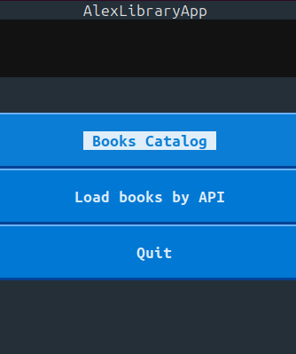
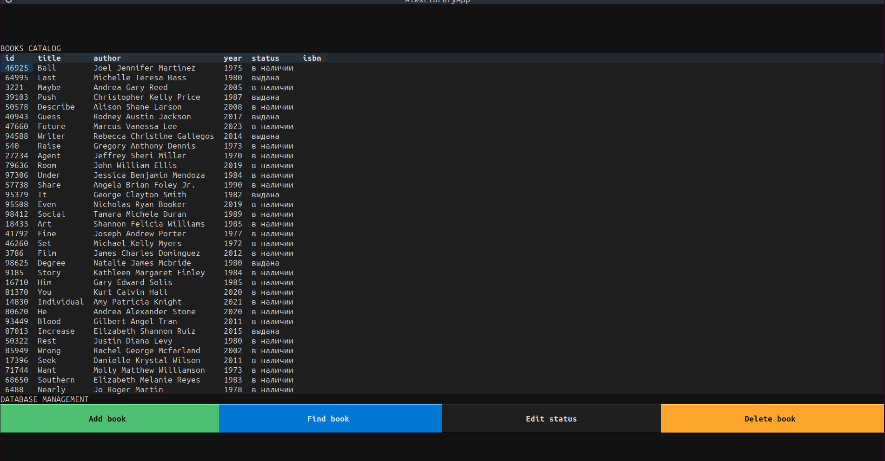
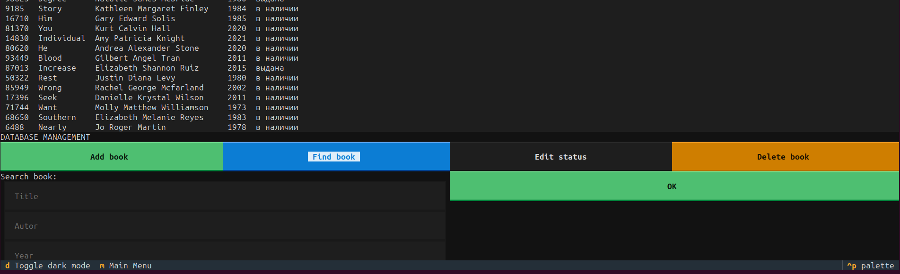
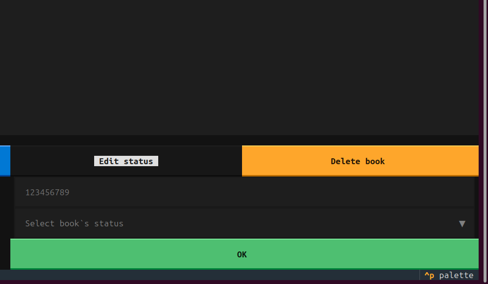

# **Alexandrian Librarian**
v.0.1
#### Stack:`pydantic, json, requests, textual, pytest`

### **Description**

# Library Management Application

The minimum viable product application is designed for managing a library of books. Users can add books, remove them, search for books based on various criteria, view a list of all books, and update the status of a book (e.g., mark it as "checked out").
This is my first app with the Textual interface.

## Features

The application provides the following functionalities:

1. **Add a book**:  
   Users can input the title, author, and publication year, and a new book is added to the library with a unique ID and a status of "available".
   
2. **Delete a book**:  
   Users can delete a book from the library by providing its unique ID.

3. **Search for a book**:  
   Users can search for books based on the following criteria:
   - `title` (book title)
   - `author` (book author)
   - `year` (publication year)

4. **View all books**:  
   The application can display a list of all books in the library, showing the book ID, title, author, year, and status.

5. **Update book status**:  
   Users can update a book's status to either "available" or "checked out" by providing its unique ID.

6. Load books by api from site and put in into database. There is only ona loader: loaders_api/loader_api_model.py. 
This is a demo version of the additional service.

## Installation

### Regular download

Download or clone the project folder (`git clone https://github.com/ReptiloidAnunak/alexandria_librarian`) 
Navigate to the root folder of the project (`cd alexandria_librarian`) and run the command to set up a virtual environment: `python3 -m venv .venv` 
Activate the virtual environment:
    Linux/Mac: `source .venv/bin/activate` 
    Windows (Command Prompt): `.venv\Scripts\activate` 
    Windows (PowerShell): `.venv\Scripts\Activate.ps1`   
Install the required libraries: `pip install -r requirements.txt` 
Run the code: `python3 textual_app.py`   

### Download with Docker 
 Download or clone the project folder (`git clone https://github.com/ReptiloidAnunak/alexandria_librarian`)
 If you do not have Docker installed, download it by following the instructions on the official [website](https://docs.docker.com/engine/install/) Ensure that you are in the root directory where the Dockerfile is located 
Run the Docker container build command: `docker build -t alexandrian_librarian .`

Run the Docker container:  `docker run -it alexandrian_librarian`

## Test 

Activate the virtual environment:
    `cd your/sys_path/alexandria_librarian/` 
    Linux/Mac: `source .venv/bin/activate` 
    Windows (Command Prompt): `.venv\Scripts\activate` 
    Windows (PowerShell): `.venv\Scripts\Activate.ps1`   
Install the required libraries: `pip install -r requirements.txt`  Run in the root app dir 
`python -m pytest`

## Bugs

! Buttons 'OK' in books catalog menu is disabled if press and after the execution of services. 
To solve it you should exit from app by `Ctrl + C` and reload it: `python3 textual_app.py`

For Docker
Ensure that you are in the root directory where the Dockerfile is located 
Exit from app by `Ctrl + C` and reload it: 
`docker run -it alexandrian_librarian`  
**Interface: Textual**

 

 

 
